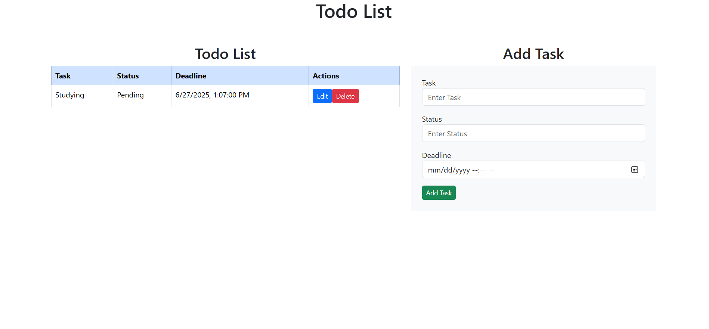

# 📝 ToDO List App - MERN Stack

A full-stack ToDo List application built with **MongoDB**, **Express**, **React**, and **Node.js**. This app allows users to create, read, update, and delete tasks with real-time UI updates.

---

## 🚀 Features

- Add new tasks with deadlines
- Mark tasks as completed
- Edit existing tasks
- Delete individual tasks
- Responsive UI with modern styling
- Persistent storage with MongoDB

--- 

## ⚙️ Tech Stack

**Frontend:**
- React.js (Hooks + Functional Components)
- Axios for HTTP requests
- CSS Modules

**Backend:**
- Node.js + Express.js REST API
- MongoDB for data storage (with Mongoose ODM)
- CORS middleware

---

## 📷 Preview



---

## 📦 Installation

### 1. Clone the repository

```bash
git clone https://github.com/Chitraksh27/todo-list.git
cd todo-list
```

### 2. Backend Setup

```bash
cd backend
npm install
node server.js
```

### 3. Frontend Setup

```bash
cd frontend
npm install
npm run dev
```

## 🙌 Acknowledgements

Built with ❤️ by Chitraksh Sharma  
Part of my MERN Stack learning journey 